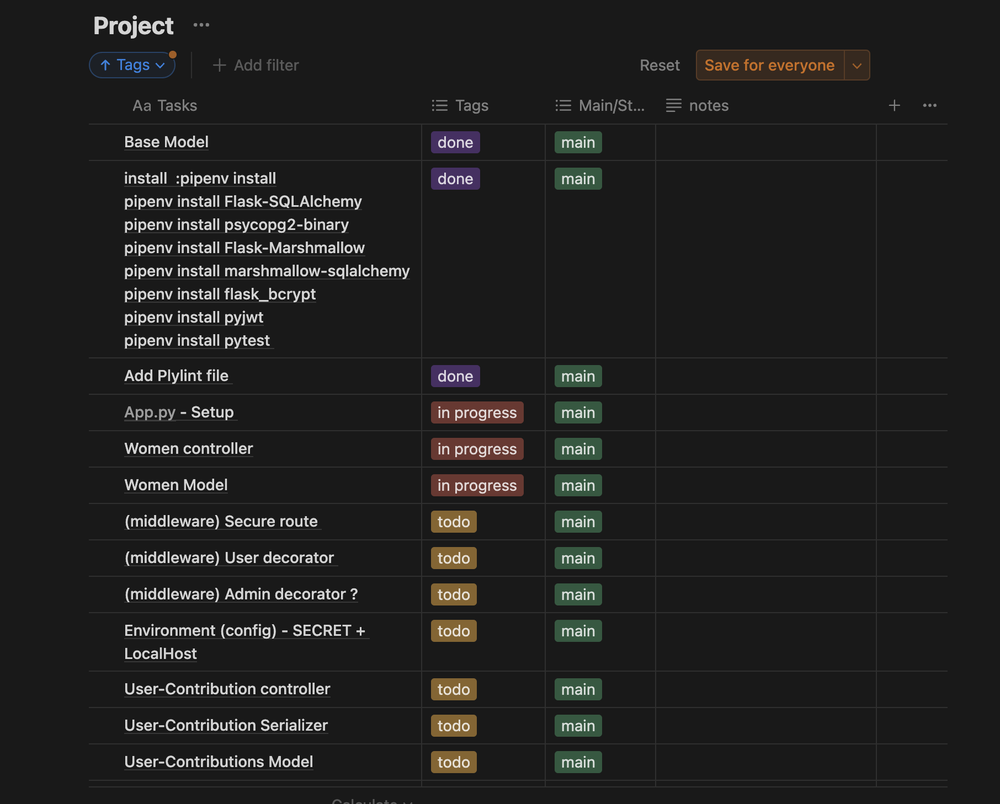
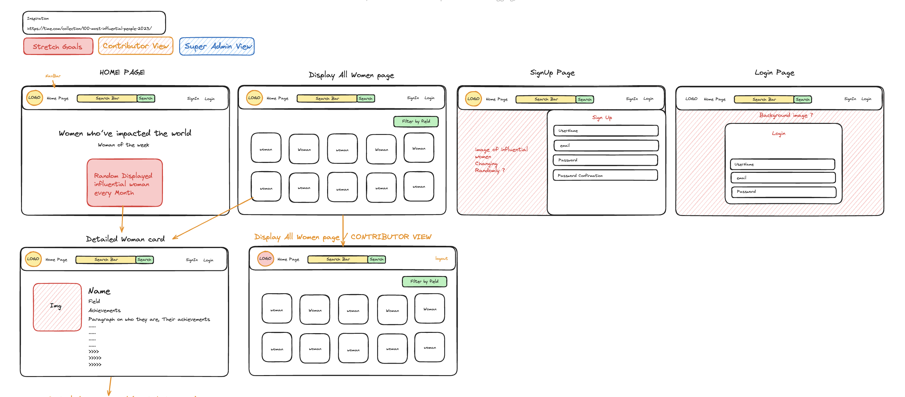
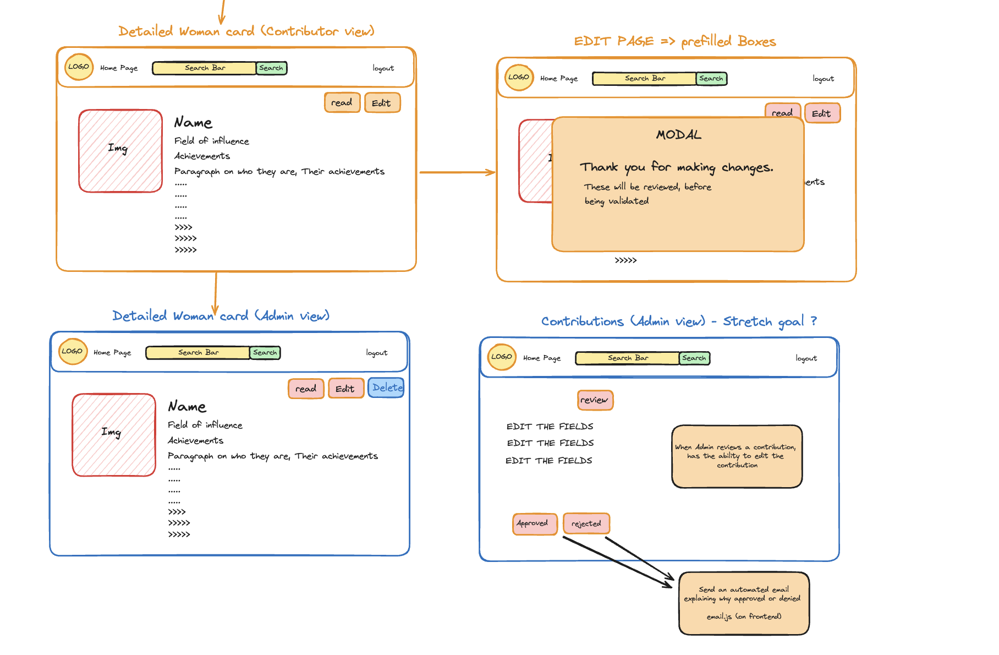
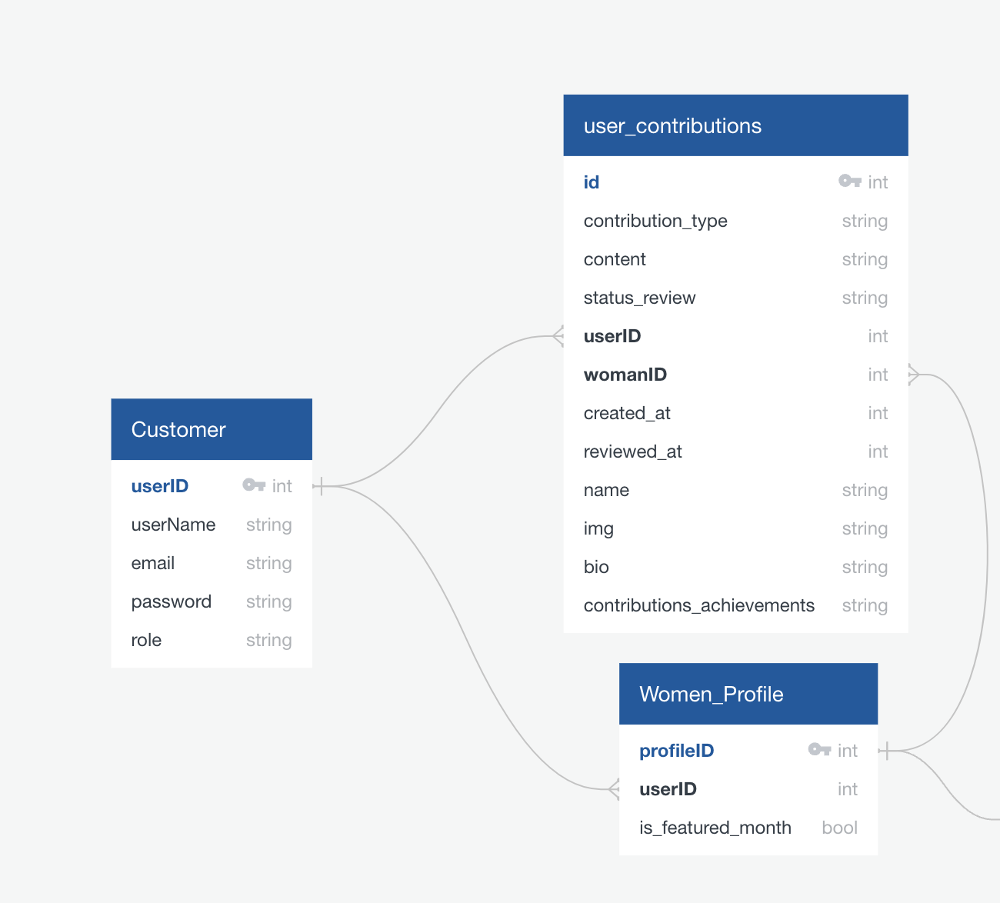
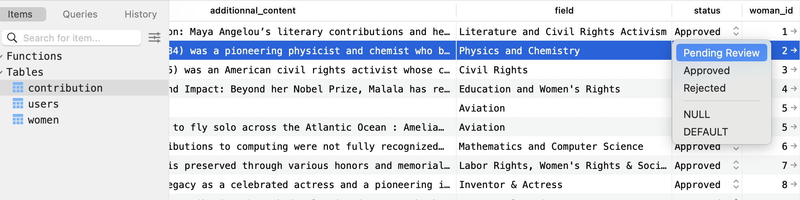
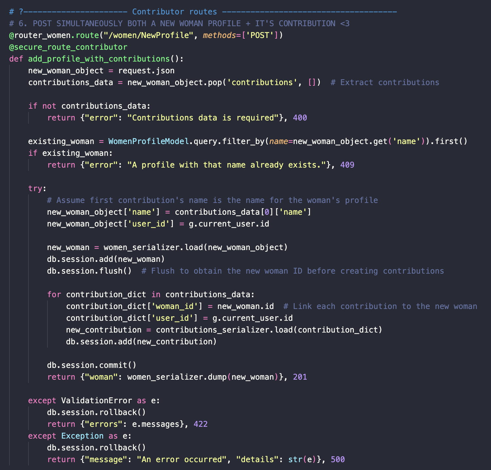

# Unsung Women

## Introduction

Welcome to "Unsung Women," a dedicated platform that shines a light on the remarkable women throughout history whose contributions have often been overlooked or forgotten. Our mission is to uncover and celebrate the stories of women who have shaped our world in profound ways. From trailblazers in science and politics to pioneers in arts and social reforms, "Unsung Women" is committed to honoring these influential figures and ensuring their achievements are recognized and appreciated by generations to come. We invite users to join us as a contributor, whether by sharing stories of women who have impacted their lifes or by helping to unearth hidden figures whose influence deserves to be acknowledged.

Unsung Women is a Wikipedia-style directory highlighting the women who have made an impact on our world throughout time.
The platform allows users to contribute content, which is moderated by administrators before being published. Contributors can track the status of their submissions through their account page, and help populate the plateform.
Help us make Unsung Women, a beutiful and rich platform, become a contributor : https://main--influential-women.netlify.app/

## Installation & Usage Instructions

If you would like to work on this project, or create a version of it, here are the following instructions to use eithe/or the front and backend.
Here are the steps to set up the project:

### Front-end:

1. Clone the front-end repository to your local machine.
2. Navigate to the root of the project directory.
3. Run npm install to install all dependencies.
4. Execute npm run dev to start the development server.
5. Open your browser and go to http://localhost:4000 to view the app.

#### Tailwind CSS framework

To use **Tailwind**, as I've used to design Unsung Women's frontend, feel free to follow these installation steps (find more @https://tailwindcss.com/docs/installation):

1. `npm install -D tailwindcss postcss autoprefixer`
2. `npx tailwindcss init -p`
3. In your `tailwind.config.js` file, you'll need to have the below:

```
/** @type {import('tailwindcss').Config} */
module.exports = {
  content: ["./src/**/*.{js,jsx,ts,tsx}"],
  theme: {
    extend: {},
  },
  plugins: [],
};
```

4. In your `post.css` file, you'll need the following:

```
module.exports = {
  plugins: {
    tailwindcss: {},
    autoprefixer: {},
  },
};
```

5. Rename your `main.scss` file to `index.css`, within your styles section
6. Add the following to the bottom of your `index.css` file (don't worry about the linting issues)

```
@tailwind base;
@tailwind components;
@tailwind utilities;
```

7. Testing: To ensure tailwind is working, feel free to try this code in you `App.tsx` file

```
import "./styles/index.css";
import React from "react";

function App() {
  return ( <>
    <div className="bg-blue-500 p-4">
      <p className="text-lg font-bold text-yellow-500">This is a</p>
      <p className="text-2xl font-extrabold text-green-500">multi-colored</p>
      <p className="text-sm font-semibold text-purple-500">sentence</p>
      <p className="text-base font-medium text-red-500">to test</p>
      <p className="text-xl font-semibold text-blue-500">Tailwind CSS</p>
      <p className="text-lg font-bold text-indigo-500">styles</p>
    </div>
  </>
  );
}

export default App;
```

### Backend:

Our Unsung Women's API utilizes Python along with Flask and SQLAlchemy. Here's how to set up the API locally:

#### Prerequisites:

Ensure you have pipenv installed. If not, you can install it using `pip install pipenv`.

#### Installation Commands:

1. **_Run the following commands to set up your environment and install all necessary dependencies:_**

```
pipenv install
pipenv install Flask-SQLAlchemy psycopg2-binary Flask-Marshmallow marshmallow-sqlalchemy flask_bcrypt pyjwt pytest
```

_Note:_ The pytest package is optional and is used for running tests on the API.

2. **_Running the API:_**
   To start the API server, use: `pipenv run flask run`.
   You should get the following message, in your terminal:

```
Running on http://127.0.0.1:4000
```

3. **_Seeding the Database:_** To seed your database, run: `pipenv run python seed.py`

4. **_Data Visualization:_** For database management and visualization, `TablePlus` is recommended. It's a versatile desktop application suitable for various databases.

## Features

### Comprehensive Directory

- Our platform is a full-stack, Wikipedia-style directory dedicated to highlighting influential women from diverse fields. It features detailed profiles that include biographies, achievements, and related multimedia.

### Dynamic Homepage

- **Engaging Video Banner**: The homepage features a captivating video banner created with Canva, setting an inspiring tone for the visitors.
- **Random Woman Feature**: Each time the homepage is loaded, a random influential woman is featured. This not only enhances the UI/UX but also educates users about women they may not yet know.
- **Browse Profiles**: The homepage also displays the entire directory. Each profile shows the woman's image, name, and field. Clicking on a profile takes users to a detailed page where they can learn more about her contributions and achievements.

### Interactive User Contributions

- **Add, Edit and Contribute**: Registered users who are logged in have the ability to edit and update profiles. This feature allows users to contribute accurate and additional information, ensuring the platform remains current and factual. They also have the ability to add a new profile to the directory. All contributions will be published only if/when approved by administrators. If denied, a new woman's profile will not be published and an existing woman's profile will not be edited.

### Moderation and Submission Tracking

- **Content Moderation**: All user contributions undergo a thorough review by administrators before being published, maintaining the integrity and accuracy of the content.
- **Track Contributions**: Contributors can track the status of their submissions (approved, pending approval, denied) through their account page, providing transparency and keeping them engaged with the process. When a contribution has been reviewed, it's status will automatically be updated in the contributor's account.

### Account Management

- Users can manage their account page, to track their contributions and their statuses and engage with the community, enhancing their overall interaction with the platform.

## Technology Stack

Our project leverages several modern technologies designed to create a robust and user-friendly experience. Below is an outline of the main tools and their roles in our system:

### Front-end:

- **React**: A JavaScript library used for building dynamic and responsive user interfaces.
- **Tailwind CSS**: A CSS framework that allows for rapid styling of the app using utility classes without writing custom CSS.
- **TypeScript**: An extension of JavaScript that adds static types, helping to prevent errors and improve code quality.

### Back-end:

- **Python**: Used to build our server-side logic
- **Flask**: A Python web framework, reknown for it's simplicity and flexibility in building web applications.
- **SQLAlchemy**: An ORM (Object Relational Mapper) for Python, making it easier to handle database operations.
- **Flask-Marshmallow**: Used for object serialization and deserialization, simplifying the conversion of complex data types to and from Python objects and formats like JSON.
- **PostgreSQL**: Our chosen database system.
- **Psycopg2**: A PostgreSQL adapter for Python, facilitating efficient and secure database connections.
- **Flask-Bcrypt**: Provides hashing utilities for securing passwords.
- **PyJWT**: A Python library for encoding and decoding JSON Web Tokens (JWT), facilitating secure user authentication.

### Testing and Tools:

- **pytest**: A framework that makes it easy to write simple and scalable test cases for the application's backend.
- **Git**: Our version control system, essential for collaborative development.
- **TablePlus**: A database management tool that provides a clean and simple interface to interact with multiple databases.

This stack ensures that our application is efficient, maintainable, and scalable, providing a great experience for developers and users alike.

## Design and Planning

Unsung Women was developed within a 6-day sprint.

### Wireframing, Designing, and Data Warehousing

The first day was dedicated to wireframing, defining the MVP and stretch goals, and assessing the project's viability in such a short period of time. Using Notion, I broke down the tasks for both the front-end and back-end in a sprint-like manner.



After considerable research to find the desired design, I decided to base the website's aesthetic on the **New York Times 100 Most Influential People of 2024**. I was inspired by its sleek yet vibrant design and the introductory video capturing key moments of the featured individuals. The design is powerful, clean, and minimalist. I aimed for a blend between Wikipedia and the New York Times' website.

**Defining the front-end design, the contributor's and admin's login pages!**  
  


The most challenging aspect was defining the backend Python models (Data Warehousing) to enable users to become contributors, allowing them to add influential women and edit existing profiles. The complexity lay in nesting a model (user_contributions model) within the women_profile model. All a profile's information would come from the user model, attached to a woman's profile. This created a one-to-many relationship.

**Defining the backend "Data Warehouse", using:**  


I also needed to decide on the number of roles that would exist, incorporating an admin to moderate the content.

### Backend programming (Python, Flask, Postgresql, marshmallow, SQLAlchemy)

he next 4 days were dedicated to setting up the backend. I divided the work into two main sprints:

#### models, serializers and controllers

First, I set up the routes in the app, creating a to-do list of the different data sources needed on the frontend. These included routes to:

- Get all existing contributions
- Generate a random profile each time the home page is loaded
- Get, create, update, and delete profiles (GET, POST, PUT, DELETE)

Most of my time was spent understanding how to handle nested models in HTML forms, which was new to me. I started by creating relationships between the models as outlined in the wireframing. Using back_populates, I established one-to-many relationships between the tables:

- Users table, where each user's role was defined (contributor or admin)
- Women profile table
- Contribution table

The challenge was to avoid creating an infinite loop when connecting the models.
Specifically, I had to include a Woman's profile ID in the contributions model to ensure consistency between the profile created and the name in the women profile model and the contributions table. Additionally, each woman's profile needed an associated user both in the women table and the contributions table to track changes and maintain a history of edits.


The biggest challenge in this phase was learning how to `GET`, as well as PUT and POST information (using a JSON object) to both the parent and nested models simultaneously. Previously, I had only dealt with single models without nested fields. The Flask and SQLAlchemy documentation proved invaluable. Serializers were essential in this phase, allowing Marshmallow to include contributions within each woman's profile:

```
class WomenSerializer(march.SQLAlchemyAutoSchema):
    contributions = fields.Nested(ContributionsSerializer, many=True)
```

One of my most useful discoveries was using `db.Enum` to limit the possible values for each field. For example, I used it to define the status of requests made by contributors:

```
status = db.Column(
          db.Enum('Pending Review', 'Approved', 'Rejected', name='status_types'),
          default='Pending Review',
          nullable=False ) # "Pending Review", "Accepted", "Rejected"
```



This approach was particularly helpful when retrieving only the approved contributions for each profile:

```
# 3. Get 1 profile with latest APPROVED contribution => to display on front-end latest approved changes for that profile

@router_women.route("/women/<int:woman_id>", methods=['GET'])
def get_single_woman_with_latest_update(woman_id):
    woman_profile = db.session.query(WomenProfileModel).get(woman_id)
    if not woman_profile:
        return {"message": "No woman profile found"}, HTTPStatus.NOT_FOUND

    latest_contribution = ContributionModel.query.filter(
        ContributionModel.woman_id == woman_id,
        ContributionModel.status == "Approved"
    ).order_by(ContributionModel.reviewed_at.desc()).first()

    if not latest_contribution:
        return {
            "woman": women_serializer.dump(woman_profile),
            "latest_contribution": None,
            "message": "No approved contributions found"
        }, HTTPStatus.OK

    return {
        'woman': women_serializer.dump(woman_profile),
        'latest_contribution': contributions_serializer.dump(latest_contribution)
    }, HTTPStatus.OK
```

#### middleware, contrbutors, admin

This step was essential to assign the correct permissions and access levels to each user or visitor.

I opted for two middlewares to simplify the process:

- One for users who signed up, allowing them to become contributors.
- One for the admin(s), who would act as the content moderator(s).

I used JSON Web Tokens (JWT) and password hashing (bcrypt) in the user model to secure and define the payload. The serializer was instrumental in specifying which information to load (load_instance, load_only). The middleware checked the current user for a token and its payload, verifying identity and permissions.

Using args and kwargs, I could run each route function through the chosen middleware.

Contributor middleware:

```
def secure_route_contributor(route_func): #as long as they have a token, they are a valid user

    @wraps(route_func)
    def wrapper(*args, **kwargs):

        raw_token = request.headers.get('Authorization') # check if token exists
        print(raw_token) # Should print the token

        if not raw_token: #if no token, return an unauthorized message
            print("missing token 😢😢😢😢😢")
            return { "message" : "Unauthorized"}, HTTPStatus.UNAUTHORIZED

        token = raw_token.replace('Bearer ', '') # Delete the bearer word in front of the token
        print(token)

        try:
            payload = jwt.decode(token, SECRET, "HS256")
            print('token is valid 🎉🎉🎉🎉', payload)

            #getting the user :
            user_id = payload['sub'] # If we want to have a user later to do things like check permissions, we should get the user from the token.
            user = db.session.query(UserModel).get(user_id) # Get the user with this ID
            g.current_user = user  # Attach this user to the request, so we can use it later.
            return route_func(*args, **kwargs)

        except jwt.ExpiredSignatureError:
            print("Expired")
            return {"message": "Token has expired"}, HTTPStatus.UNAUTHORIZED
        except Exception:
            print("Issue with token - From secure_route_contributor")
            return {"message": "Unauthorized 🎉"}, HTTPStatus.UNAUTHORIZED


    return wrapper
```

And then applying the correct middleware to each route function.



#### Seeding

The l

## Project Status / Future Enhancements
